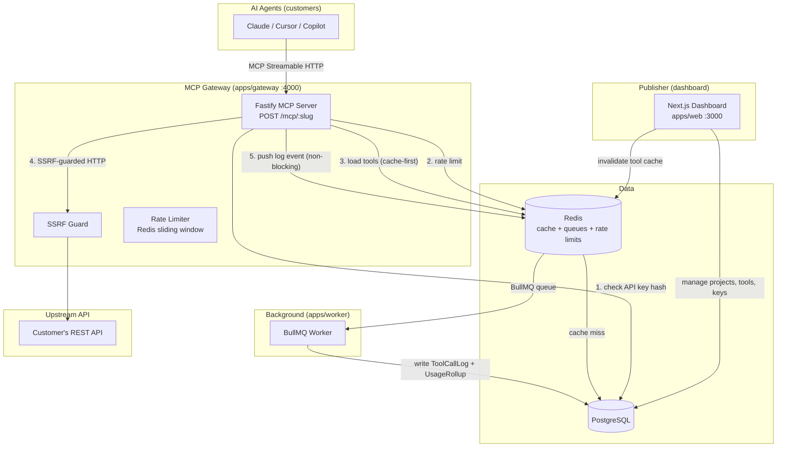

# Architecture

> Last updated: Phase 2 — Hosted MCP server

## System Overview

MCP Gateway is a multi-tenant SaaS platform. A **publisher** (an API team) creates a project, imports their OpenAPI spec, curates a set of MCP tools, and gets a hosted MCP endpoint their customers' AI agents can call.

## Packages

| Package | Purpose |
|---|---|
| `apps/web` | Next.js App Router dashboard — UI + server actions + route handlers |
| `apps/gateway` | Fastify MCP server — public, multi-tenant, stateless |
| `apps/worker` | BullMQ consumer — writes logs + computes analytics rollups |
| `packages/db` | Prisma schema, client singleton (driver adapter), migrations, seed |
| `packages/shared` | SSRF-safe fetch, env validation, Redis cache key names and invalidation helpers |
| `packages/openapi-tools` | Pure library: OpenAPI → tool definitions, argument-to-request mapping, request building, re-import merging |
| `packages/crypto` | AES-256-GCM encrypt/decrypt + API key generation/hashing |

## Key Design Decisions

See [DECISIONS.md](./DECISIONS.md) for the full log.

- **The gateway is read-mostly** — it reads from Redis cache (fallback to Postgres) and will push log events to BullMQ (Phase 3). Its only write is `ApiKey.lastUsedAt`, at most once per key per 5 minutes and off the request path. This keeps the request path fast and decoupled from write latency.
- **API keys stored as SHA-256 hashes** — full key shown once, never stored. Prefix stored for UI display.
- **Upstream credentials encrypted at rest** — AES-256-GCM, key from `ENCRYPTION_KEY` env var.
- **SSRF protection** — block private/loopback IP ranges before calling any user-supplied upstream URL.
- **Driver adapter pattern** — `@prisma/adapter-pg` + `pg` for explicit connection pool control and compatibility with edge runtimes.

## Request path: a `tools/call`

`POST /mcp/:projectSlug` on the gateway. It is stateless: a fresh MCP server object per request, no sessions.

1. **Authenticate.** `Authorization: Bearer <key>` is parsed, SHA-256 hashed and looked up (Redis, then Postgres). The key must belong to the project in the URL. Every failure (missing, malformed, unknown, revoked, another project's key, unknown slug) gives the same 401, so slugs cannot be enumerated.
2. **Load the project.** The base URL, the encrypted credential and the enabled tools (with their argument-to-request maps) come from `mcp:cfg:<slug>` in Redis, or are built from Postgres and cached.
3. **Resolve the tool.** Only enabled, non-removed tools exist. Anything else is the same `-32602` "Unknown tool".
4. **Validate** the arguments against the tool's agent-facing schema (hidden parameters removed). A failure is an `isError` result the model can read and correct.
5. **Build the request.** Hidden parameters' fixed values are merged last, so they always win. Arguments are mapped to path, query, header, cookie or body.
6. **Authenticate to the upstream.** The credential is decrypted in memory for this one call and sent as a bearer token, a custom header, or a query parameter.
7. **Call the upstream** through `ssrfFetch`: public addresses only, no redirects, one 15 s deadline, a 1 MB response cap.
8. **Answer.** A 2xx becomes text content. Everything else (4xx/5xx, timeout, oversize, redirect, blocked host, unreachable) becomes an `isError` result with fixed wording. The credential is scrubbed from every outgoing string, in raw, URL-encoded and base64 form.

## Caching and invalidation

Redis only caches what Postgres already holds, so a Redis failure is a cache miss, never an outage.

| Key | Holds | TTL | Cleared when |
|---|---|---|---|
| `mcp:cfg:<slug>` | base URL, encrypted credential, enabled tools and their request maps | 5 min | a tool is edited or toggled, a spec is imported, project settings or the credential change, the project is deleted |
| `mcp:key:<hash>` | API key lookup (a miss is cached for 10 s) | 30 s | the key is revoked, or its project is deleted |

The dashboard clears keys through `CacheInvalidator` and fails open: if Redis is unreachable the edit still succeeds, a warning is logged, and the TTL bounds the staleness (a revoked key keeps working for at most 30 s).

## Deploying the gateway

`apps/gateway/Dockerfile` builds a standalone image (multi-stage, non-root, production dependencies only) that is configured purely by environment variables: `DATABASE_URL`, `REDIS_URL`, `ENCRYPTION_KEY`, and optionally `PORT`, `DATABASE_POOL_MAX`, `TOOL_CALL_TIMEOUT_MS` and `TOOL_RESPONSE_MAX_BYTES`. It listens on `PORT` (what Render and Koyeb assign), serves `/health`, drains on SIGTERM, and never runs migrations. Set `GATEWAY_PUBLIC_URL` on the web app to the URL agents will use.
