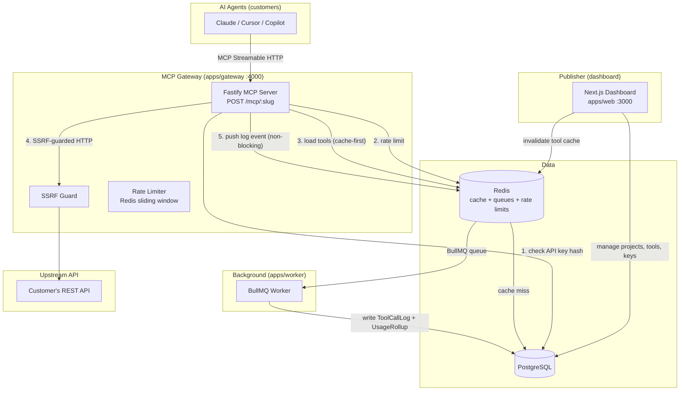

# Architecture

> Last updated: Phase 0 — Foundation

## System Overview

MCP Gateway is a multi-tenant SaaS platform. A **publisher** (an API team) creates a project, imports their OpenAPI spec, curates a set of MCP tools, and gets a hosted MCP endpoint their customers' AI agents can call.

## Packages

| Package | Purpose |
|---|---|
| `apps/web` | Next.js App Router dashboard — UI + server actions + route handlers |
| `apps/gateway` | Fastify MCP server — public, multi-tenant, stateless |
| `apps/worker` | BullMQ consumer — writes logs + computes analytics rollups |
| `packages/db` | Prisma schema, client singleton (driver adapter), migrations, seed |
| `packages/shared` | Zod schemas and shared TypeScript types used across apps |
| `packages/openapi-tools` | Pure library: OpenAPI → MCP tool definitions (Phase 2) |
| `packages/crypto` | AES-256-GCM encrypt/decrypt + API key generation/hashing |

## Key Design Decisions

See [DECISIONS.md](./DECISIONS.md) for the full log.

- **Gateway never writes to DB directly** — it reads from Redis cache (fallback to Postgres) and pushes log events to BullMQ. This keeps the request path fast and decoupled from write latency.
- **API keys stored as SHA-256 hashes** — full key shown once, never stored. Prefix stored for UI display.
- **Upstream credentials encrypted at rest** — AES-256-GCM, key from `ENCRYPTION_KEY` env var.
- **SSRF protection** — block private/loopback IP ranges before calling any user-supplied upstream URL.
- **Driver adapter pattern** — `@prisma/adapter-pg` + `pg` for explicit connection pool control and compatibility with edge runtimes.
