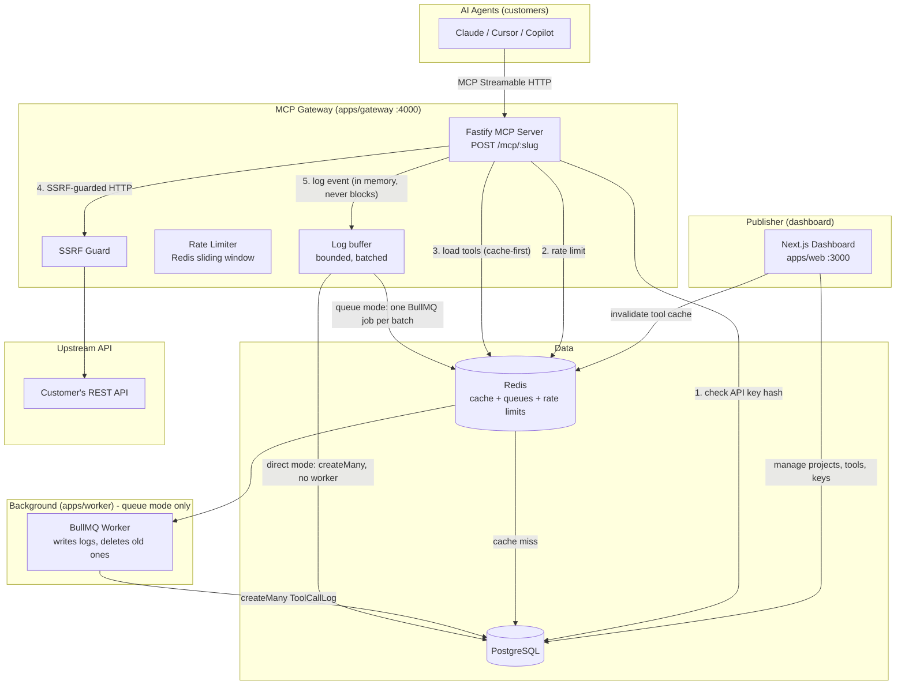

# Architecture

> Last updated: Phase 3 — Rate limiting and call logging

## System Overview

MCP Gateway is a multi-tenant SaaS platform. A **publisher** (an API team) creates a project, imports their OpenAPI spec, curates a set of MCP tools, and gets a hosted MCP endpoint their customers' AI agents can call.



## Packages

| Package | Purpose |
|---|---|
| `apps/web` | Next.js App Router dashboard — UI + server actions + route handlers |
| `apps/gateway` | Fastify MCP server — public, multi-tenant, stateless |
| `apps/worker` | BullMQ consumer (queue mode) — writes call-log batches to Postgres and deletes rows past retention |
| `packages/db` | Prisma schema, client singleton (driver adapter), migrations, seed |
| `packages/shared` | SSRF-safe fetch, env validation, Redis cache key names and invalidation helpers |
| `packages/openapi-tools` | Pure library: OpenAPI → tool definitions, argument-to-request mapping, request building, re-import merging |
| `packages/crypto` | AES-256-GCM encrypt/decrypt + API key generation/hashing |

## Key Design Decisions

See [DECISIONS.md](./DECISIONS.md) for the full log.

- **The gateway is read-mostly** — it reads from Redis cache (fallback to Postgres). Its writes are `ApiKey.lastUsedAt` (at most once per key per 5 minutes) and, in direct mode, call-log batches; both are off the request path, so the request path stays decoupled from write latency.
- **API keys stored as SHA-256 hashes** — full key shown once, never stored. Prefix stored for UI display.
- **Upstream credentials encrypted at rest** — AES-256-GCM, key from `ENCRYPTION_KEY` env var.
- **SSRF protection** — block private/loopback IP ranges before calling any user-supplied upstream URL.
- **Driver adapter pattern** — `@prisma/adapter-pg` + `pg` for explicit connection pool control and compatibility with edge runtimes.

## Request path: a `tools/call`

`POST /mcp/:projectSlug` on the gateway. It is stateless: a fresh MCP server object per request, no sessions.

1. **Authenticate.** `Authorization: Bearer <key>` is parsed, SHA-256 hashed and looked up (Redis, then Postgres). The key must belong to the project in the URL. Every failure (missing, malformed, unknown, revoked, another project's key, unknown slug) gives the same 401, so slugs cannot be enumerated.
2. **Load the project.** The base URL, the encrypted credential and the enabled tools (with their argument-to-request maps) come from `mcp:cfg:<slug>` in Redis, or are built from Postgres and cached.
3. **Rate limit.** A `tools/call` counts against the key's limit (`ApiKey.rateLimitPerMin`, calls per rolling 60 s); over it, the answer is HTTP 429 with `Retry-After` before anything else runs. Other methods (`initialize`, `tools/list`) are free. See below.
4. **Resolve the tool.** Only enabled, non-removed tools exist. Anything else is the same `-32602` "Unknown tool".
5. **Validate** the arguments against the tool's agent-facing schema (hidden parameters removed). A failure is an `isError` result the model can read and correct.
6. **Build the request.** Hidden parameters' fixed values are merged last, so they always win. Arguments are mapped to path, query, header, cookie or body.
7. **Authenticate to the upstream.** The credential is decrypted in memory for this one call and sent as a bearer token, a custom header, or a query parameter.
8. **Call the upstream** through `ssrfFetch`: public addresses only, no redirects, one 15 s deadline, a 1 MB response cap.
9. **Answer.** A 2xx becomes text content. Everything else (4xx/5xx, timeout, oversize, redirect, blocked host, unreachable) becomes an `isError` result with fixed wording. The credential is scrubbed from every outgoing string, in raw, URL-encoded and base64 form.

Each tool call also produces a log event (see Call logging), including calls that failed validation, named an unknown tool or were rate limited.

### Rate limiting

One Redis sorted set per key (`mcp:rl:<apiKeyId>`) holds a member per accepted call, scored by its time. One Lua script trims, counts and either rejects (returning the exact wait) or records the call, so concurrent requests cannot all pass the check. The clock is the gateway's, passed in as an argument. Rejected calls are not recorded. The 429 body is a JSON-RPC error (code -32029) whose message names the limit and the wait, because MCP clients print the body and not the status. If Redis is unreachable the call is allowed (fail open), a 5 s circuit breaker stops each call from waiting out the Redis timeout, and one warning is logged per window.

## Call logging

Every `tools/call` and, sampled, every auth failure and rate-limit rejection becomes a `LogEvent` (`packages/shared/src/log-event.ts`): project, key, tool name, status, latency, upstream status, error class, a one-line error message and the response size. Arguments are masked and bounded before the event exists, so secrets never reach Redis or Postgres. **Stored never:** response bodies, the request URL, query strings, redirect targets, upstream credentials, hidden parameter values, API keys or any derivative of one. An auth failure stores only the project slug from the URL and a reason.

```
request path --enqueue (sync, never throws)--> BufferedLogSink --batch--> writer
                                                                          |-- queue mode:  BullMQ job per batch --> worker --> createMany
                                                                          `-- direct mode: createMany in the gateway (no worker, no BullMQ)
```

| Setting | Default | Meaning |
|---|---|---|
| `LOG_SINK` | `queue` | `queue` (worker writes) or `direct` (gateway writes; use where the worker cannot run) |
| `LOG_BUFFER_MAX` | 1000 | Events held in memory. Full: the **new** event is dropped and counted, with one warning per 30 s. (One batch in flight comes on top of this.) |
| `LOG_BATCH_SIZE` | 100 | Events per write |
| `LOG_FLUSH_INTERVAL_MS` | 2000 | Flush cadence |
| `LOG_SHUTDOWN_FLUSH_MS` | 5000 | On SIGTERM, how long to keep trying to write what is buffered |
| `LOG_RETENTION_DAYS` | 30 | Older rows are deleted |

- **Retries.** A failed or timed-out write (10 s) puts the batch back at the front of the buffer and retries with backoff (1 s doubling to 30 s). The row id is the event id, so a batch that was in fact written is skipped on redelivery (`skipDuplicates`).
- **Shutdown.** The sink closes in the app's `onClose` hook, after in-flight requests finished and before Redis and Postgres are disconnected. A SIGKILL or crash loses what was buffered (up to one flush interval of events); this was measured in the Linux image.
- **Sampling.** Auth failures and rate-limit rejections come from callers who may be hostile or hammering: one row per slug or key and reason per 10 s per instance, at most 200 sampled rows per 10 s overall. Counts of those two classes are therefore "at least".
- **Tenancy.** The writer keeps a tool or key id only if it belongs to the event's own project, and resolves a slug to a project itself; unknown slugs are dropped.
- **Retention.** `purgeOldLogs` (`packages/db`) deletes in batches of 5000 and is idempotent. Both modes run it once about a minute after boot (with jitter), then every 6 h. Queue mode: the worker, on an idempotent BullMQ job scheduler whose first run is delayed with `startDate`. Direct mode: the gateway, with timers. A host that sleeps when idle also writes no logs while asleep, so the run at wake-up is enough. Several instances running it together is harmless.

## Caching and invalidation

Redis only caches what Postgres already holds, so a Redis failure is a cache miss, never an outage.

| Key | Holds | TTL | Cleared when |
|---|---|---|---|
| `mcp:cfg:<slug>` | base URL, encrypted credential, enabled tools and their request maps | 5 min | a tool is edited or toggled, a spec is imported, project settings or the credential change, the project is deleted |
| `mcp:key:<hash>` | API key lookup (a miss is cached for 10 s) | 30 s | the key is revoked, or its project is deleted |

The dashboard clears keys through `CacheInvalidator` and fails open: if Redis is unreachable the edit still succeeds, a warning is logged, and the TTL bounds the staleness (a revoked key keeps working for at most 30 s).

## Deploying the gateway

`apps/gateway/Dockerfile` builds a standalone image (multi-stage, non-root, production dependencies only) that is configured purely by environment variables: `DATABASE_URL`, `REDIS_URL`, `ENCRYPTION_KEY`, and optionally `PORT`, `DATABASE_POOL_MAX`, `TOOL_CALL_TIMEOUT_MS`, `TOOL_RESPONSE_MAX_BYTES` and the call-log settings above. With no worker (a free Redis plan cannot afford BullMQ's polling), set `LOG_SINK=direct`. It listens on `PORT` (what Render and Koyeb assign), on every interface because `NODE_ENV=production` (`HOST` overrides; outside production the default is `127.0.0.1`, so a development gateway is not reachable from other machines on the network), serves `/health`, drains on SIGTERM, and never runs migrations. Set `GATEWAY_PUBLIC_URL` on the web app to the URL agents will use.
